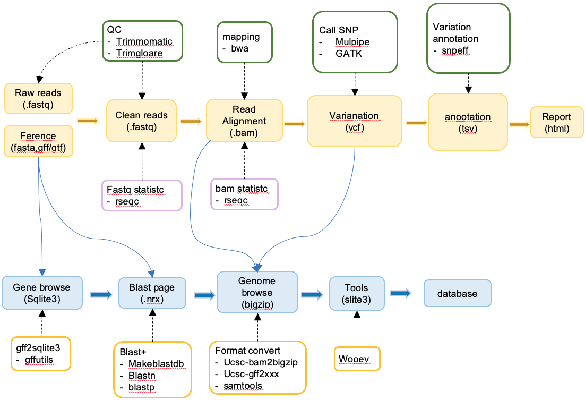

# resequcing analysis

!!! note "A typical flow of resequencing analysis with reference is shown in the figure below"
    <figure markdown> 
        { width="800" }
        <figcaption>resequencing pipeline</figcaption>
    </figure>

Two way to run:

=== "multi-parameter way"

    ```
    ngspipedb runpipe ngspipe-run-resequencing -n ngspipe-resequencing --resultdirname result -d ../test_pipeline --genomeFasta ../testdata_ngspipe-rnaseq-basic/genome/chr19.fa --genomeAnno ../testdata_ngspipe-rnaseq-basic/genome/GRCm38.83.chr19.gtf --samplefile ../testdata_ngspipe-rnaseq-basic/rawdata/sample.csv --rawreadsdir ../testdata_ngspipe-rnaseq-basic/rawdata --snaketype p --readsprefix _R{}.fq.gz -j 1
    ```

    - `ngspipe-run-resequencing` your project name
    - `-n ngspipe-resequencing` pipeline name
    - `-d ../test_pipeline` working directory
    - `--genomeFasta ../testdata_ngspipe-rnaseq-basic/genome/chr19.fa` give a genome fasta file path, see file format [fasta](https://en.wikipedia.org/wiki/FASTA_format)
    - `--genomeAnno ../testdata_ngspipe-rnaseq-basic/genome/GRCm38.83.chr19.gtf` give a genome annotaion file path [gtf](https://genome.ucsc.edu/FAQ/FAQformat.html#format4)/[gff](https://genome.ucsc.edu/FAQ/FAQformat.html#format3)
    - `--samplefile ../rawdata/sample.csv` give a sample file path, which has one column
    - `--rawreadsdir ../testdata_ngspipe-rnaseq-basic/rawdata` raw reads directory
    - `--snaketype p` run pipeline and print all shell command
    - `--readsprefix _R{}.fq.gz` this will find sample_R1.fq.gz and sample_R2.fq.gz automate
    - `-j 1` cpu number

=== "use configfile way"

    1. start a project in current directory:
        ```shell
        ngspipedb startproject ngspipe-run-resequencing2 -n ngspipe-resequencing -d ../test_pipeline
        ```
        - PROJECTNAME: ngspipe-run-resequencing
        - pipeline: ngspipe-resequencing
        - `tree ngspipe-run-resequencing`
            ```
            ├── database
            ├── genome
            ├── ngsdb_config.yaml
            ├── ngspipe_config.yaml
            └── rawdata
                └── sample.csv
            3 directories, 3 files
            ```
        
    2. copy your file to directory:
        ```
        ├── database
        ├── genome
        │   ├── GRCm38.83.chr19.gtf
        │   ├── chr19.fa
        │   └── chr19.fa.fai
        └── rawdata
            ├── control-0_R1.fq.gz
            ├── control-0_R2.fq.gz
            ├── control-1_R1.fq.gz
            ├── control-1_R2.fq.gz
            ├── control-2_R1.fq.gz
            ├── control-2_R2.fq.gz
            ├── sample.csv
            ├── treated-0_R1.fq.gz
            ├── treated-0_R2.fq.gz
            ├── treated-1_R1.fq.gz
            ├── treated-1_R2.fq.gz
            ├── treated-2_R1.fq.gz
            └── treated-2_R2.fq.gz
        ```
        - genome: the genome file
        - rawdata: resequencing data
    
    3. modify configfile file `ngspipe-run-resequencing/ngspipe_config.yaml`:

        ```yaml
        #---------------------------
        # medicago tnt1
        #---------------------------

        ## 1.reference ##
        genomeAnno_path: "genome/GRCm38.83.chr19.gtf" # gene annotation file, can be gtf or gff format
        genomeFasta_path: "genome/chr19.fa" # genome sequence, fasta format

        ## 2.raw reads data ##
        sample_path: "rawdata/sample.csv" # sample file
        rawreads_dir: "rawdata" # sample file directory
        read1Suffix: "_R1.fq.gz" # fastq suffix, read1
        read2Suffix: "_R2.fq.gz"

        ## 3.output directory ##
        results_name: "results"

        ## 4.notice ##
        # if the string is 'nobody', ngspipe will not send email
        # modify 'noboby' to 'xxx@qq.com' or 'xxx@qq.com,yyy@qq.com' to send email
        email_addr: 'nobody'

        # choose where to stop your pipeline
        target: all #

        #----------------------------------
        # Configuration for sampling data
        #----------------------------------

        # for test the pipe, you can choose to the part of the input file
        # which sampling method do you want to use?
        sampling_method: links # links or head or tail or seqkit_number or seqkit_proportion
        # Default is links (ues the whole data of sample); head (use first sampling_range line in every sample),tail (use last sampling_range line in every sample); seqkit_number (number of reads); seqkit_proportion (percentage of reads)
        # and how many reads file line or reads number or reads proportion do you want to use?
        sampling_value: 80000 # for head and tail, this value is line number; for number, this value is reads number; for proportion, this value is percentage

        samples_num: all # all or interger
        # Default is all (use all samples), give a sample number, must less than real sample number, for example 6

        #----------------------------------
        # Configuration for Quality Control
        #----------------------------------
        # which qc method do you want to use?

        qc_method: trim-galore # trim-galore or trimmomatic or fastqc

        #----------------------------------
        # Configuration for Genome cut
        #----------------------------------
        # which part of genome do you want to use?
        sub_genome: all # all (whole genome) or chr1:10000-20000 (seq name:start position-end position) or chr1 (seq name)
        ```
    
    4. run command:
        ```shell
        ngspipedb runpipe ngspipe-run-resequencing -n ngspipe-resequencing -c ngspipe-run-resequencing/ngspipe_config.yaml -j 1
        ```