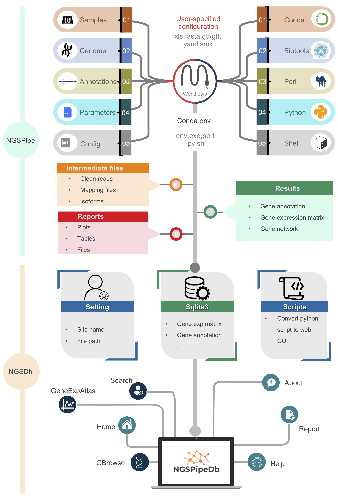

# NGSPipeDb - NGS pipeline and database

__Author:__ Dr. Xuan Zhang* <sup>[](https://github.com/xuanblo)</sup> <sup>[](https://scholar.google.com/citations?user=omUk0vUAAAAJ)</sup>  
__Last update:__ 2021-01-20*  
__Citation:__ NGSPipeDb: An automated pipeline for parallel processing of huge NGS data and database generation.

__Table of Contents:__

- [Introduction to NGSPipeDb](#Intro)
- [System requirements](#Require)
- [Anatomy of a NGSPipeDb project](#Anatomy)
- [Basics: An example execution of RNA-seq analysis with test data](#QuickStarted)

- [Advance: An example execution of RNA-seq analysis with custome data](#QuickStarted)
- [Reproducibility](#Reproducibility)
- [Troubleshooting](#Troubleshooting)

## Introduction to NGSPipeDb <a name="Intro"></a>

__NGSPipeDb__ is an automated pipeline for parallel processing of huge next generation sequencing (NGS) data and database generation using [snakemake workflow](https://snakemake.readthedocs.io/en/stable/index.html) which allows for ease of use, optimal speed, and a highly modular code that can be further added onto and customized by experienced users. It can be further divided into `NGSPipe` and `NGSDb` for individual usage. 

__NGSPipe__ consists of a [Snakefile](https://snakemake.readthedocs.io/en/stable/snakefiles/rules.html) (`ngspipe/rnaseq.snakefile.py`, it includes some basic rules `ngspipe/rule/*.snakefile.py`), [conda](https://conda.io/docs/) environment files (`ngspipe/envs/*.yaml`), a configuration file (`ngspipe/config/rnaseq.config.yaml`), a set of [python](#), [R](#), [Shell](#) and [Perl](#) scripts (`ngspipe/scripts/*.py`), and a set of [reStructuretext](#) reports (`reports/*.rst`). It combines the use of several dozen omic-seq tools, suites, and packages to create a complete pipeline that takes [RNA-seq analysis](), [resequcing analysis]() etc. from raw sequencing data all the way through alignment, quality control, unsupervised analyses, differential expression, and downstream pathway analysis. It is implemented such that alternative or similar analysis can be added or removed. The results are compiled in a simple and highly visual [report](ngspipe/metadata/report.html) containing the key figures to explain the analysis, and then compiles all of the relevant files, tables, and pictures into an easy to navigate folder. Table file such as csv, tsv, xlsx etc. 

It is based on snakemake and includes the following tools:
* shovill (based on Spades)
* QUAST v.5 (including BUSCO)
* mash
* fastp

It will read untrimmed raw data from your illumina sequencing experiments as paired .fastq.gz-files. These are then trimmed, assembled and polished. Besides generating ready-for-use contigs, AQUAMIS will select the closest reference genome from NCBI RefSeq and produce an intuitive, detailed report on your data and assemblies to evaluate its reliability for further analyses. It relies on reference-based and reference-free measures such as coverage depth, gene content, genome completeness and contamination, assembly length and many more. Based on the experience from thousands of sequencing experiments, threshold sets for different species have been defined to detect potentially poor results.

In addition, __NGSDb__ has been outfitted with several recently published tools that allow for visualize and data share.can be convert to [Sqlite3](#) format. The [Django](#) project and apps can be orgined by user defined. It is easy to share your data with a web inteface. a set of `apps` (such as `home`, `igv`, `geneExpAtlas`, `efp brwose`).

By default, the __NGSPipeDb__ performs all the steps shown in the [diagram](img/report_2019_03_14_salmonAlignment_visualization.png) below. However, advanced user, you can easily modify the `Snakefile` and the `config.yaml` and/or add "custom rules" to enable additional functions.



Currently, transcript quantification with `Salmon` at the read-level or gene quantification by [`featureCounts`](http://subread.sourceforge.net) can be activated.
The first version handles [RNA-Seq](#) workflow.

Workflows available:
- RNA-seq
- ChIP-seq
- Resequencing

__TODO__:

- NGSPipe
    1. miRNA
    2. scRNA-seq
    3. ATAC-seq
- NGSdb
    1. efp browser

## System requirements <a name="Require"></a>

Building NGSPipeDb and running the examples require Linux, MacOS or Windows Subsystem for Linux ([WSL](https://wiki.ubuntu.com/WSL)) on Win10. Other Unix environments will probably work but have not been tested.

The test data can be run on personal computer, for example 8G memeory.

Some of the tools that NGSPipeDb uses, e.g. STAR and cufflinks are very memory intensive programs. Therefore we recommend the following system requirements for NGSPipeDb:

We recommend that you run NGSPipeDb on a server that has at least 30GB of ram. This will allow for a single-threaded NGSPipeDb run (on mouse samples).

We recommend that you have at least 128GB of ram and at least a 4-core CPU if you want to run NGSPipeDb in multi-threaded mode (which will speedup the workflow significantly). Our own servers have 256GB of ram and 32 cores.

## Anatomy of a NGSPipeDb project <a name="Anatomy"></a>

It is recommended to download NGSPipeDb source and change its name to your project name (For example: `mv NGSPipeDb mouse_transcriptome_analysis`), it may looks like the following structure (command: `tree -d -L 2 mouse_transcriptome_analysis`):

```shell
mouse_transcriptome_analysis
├── README.md
├── ngsdb
│   ├── blastplus
│   ├── db.sqlite3
│   ├── geneAnno
│   ├── geneExpAtlas
│   ├── home
│   ├── igv
│   ├── manage.py
│   └── ngsdb
├── ngspipe
│   ├── config
│   ├── db_generate.Snakefile.py
│   ├── envs
│   ├── imgs
│   ├── notebooks
│   ├── reports
│   ├── rnaseq_analysis.Snakefile.py
│   ├── rules
│   └── scripts
├── results
│   ├── report
│   ├── resultdata
│   └── sqlite3
└── testdata
```

The workflow code goes into a subfolder `ngspipe`, while the configuration is stored in a subfolder `config`. Inside of the workflow subfolder, the central Snakefile marks the entrypoint of the workflow. In addition to the central Snakefile, rules are stored in a modular way, using the optional subfolder `ngspipe/rules`. Further, scripts are stored in a subfolder `workflow/scripts` and notebooks in a subfolder `workflow/notebooks`. Conda environments are stored in a subfolder `workflow/envs`. Finally, report caption files are stored in `workflow/report`. 

The database code goes into a subfolder `ngsdb`, while the `manage.py` is ngsdb's command-line utility for administrative tasks. A golabl setting file is stored under `ngsdb/ngsdb`, such as `ngsdb/ngsdb/setting.py` and `ngsdb/ngsdb/urls.py`. Many ngsdb function module take a app name. For example, if your INSTALLED_APPS in `ngsdb/ngsdb/setting.py` contains the string 'igv', the database will contain a page of IGV genome browser.

All output files generated in the workflow should be stored under `results/result`, unless they are rather retrieved report, in which case they should be stored under `results/report`. The latter subfolder `results/sqlite3` contains Sqlite3 kind file that shall be used by ngsdb.

## Basics: An example execution of RNA-seq analysis with test data

## Advance: An example execution of RNA-seq analysis with custome data

## Reproducibility <a name="Reproducibility"></a>

conda环境克隆conda create -n ngspipedb_py38_conda_env --clone ./ngspipedb_py38_conda_env/

1. use conda env export

```shell
cd NGSPipeDB_source_code
# export to yaml
conda env export --no-builds -p ./ngspipedb_py38_conda_env >ngspipedb_py38_conda_env.yaml
```

2. use conda pack

用--use-conda这个参数的话，因为所有软件的环境都是单独的，所有conda安装的时候不会出错，那么如果已经下载安装好了环境，用这种方式如何使用？默认的环境是.snakemake文件夹下，如何指定？
用上面的方式好安装，不会出错，但是会导致文件很大，多大？
是否能把一环境分成两部分？一部分软件集合起来变成一个大环境，另一部分软件就用--use-conda环境单独指定，但是这两种方式能结合到一起用吗？

```shell
# pack
cd NGSPipeDB_source_code
mamba install -c conda-forge conda-pack
conda pack -p ./ngspipedb_py38_conda_env -o ngspipedb_py38_conda_env_osx64.tar.gz
# unpack on another machine
mkdir -p ngspipedb_py38_conda_env
tar -xzf ngspipedb_py38_conda_env_osx64.tar.gz -C ngspipedb_py38_conda_env
source activate ./ngspipedb_py38_conda_env
conda-unpack
```

conda config --add channels https://mirrors.tuna.tsinghua.edu.cn/anaconda/pkgs/free/
conda config --add channels https://mirrors.tuna.tsinghua.edu.cn/anaconda/pkgs/main/
conda config --add channels https://mirrors.tuna.tsinghua.edu.cn/anaconda/cloud/conda-forge/
conda config --add channels https://mirrors.tuna.tsinghua.edu.cn/anaconda/cloud/bioconda/

2. activate base and set miniconda path
conda init

3. Conda Prompt Customization
conda config --set env_prompt '({name}) '

source ~/.bashrc

4. update conda, (optional)
conda update conda

5. create conda visual environment, python version, snakemake version, env directory,django version
conda create -p ngspipedb_py38_conda_env python=3.8

6. activate conda env
conda activate ./ngspipedb_py38_conda_env

6. install mamba to make install software faster.
conda install mamba -c conda-forge

8. update some bioinformatics tools we will use bellow.
mamba env update --prefix ./ngspipedb_py38_conda_env/ --file requirement.yaml  --prune

9. you can exit virtual environment by 
conda deactivate
https://wooey.readthedocs.io/en/latest/install.html

--conda-frontend mamba 选择更快一点的mamba

--conda-create-envs-only 只创建环境，然后退出，不运行程序，这个可以用来专门测试环境

mac上的conda环境好像没有linux上面那么好用，特别是anaconda创建的环境
--conda-prefix 指定conda环境安装地址
清理conda安装包和缓存
snakemake -s ngspipe/db_generate.Snakefile.py --use-conda --conda-prefix condaEnvSplit -p -j1

Simplest is just abandon the --use-conda flag, as suggested in the answer. Alternatively, you could make a container that has the env pre-created and configured, then use --use-singularity. Or, if the post-installation can be automated, one could build a custom Conda package that runs some post-linking scripts. Sorry I seem to have missed your comment!

snakemake 如何运行单个程序？这个也很有用
基因的命令，像dkango这样的命令在很多rules中都有，所有比如有个顶层的环境中安装了django

## Troubleshooting <a name="Troubleshooting"></a>

Ngsdb.yaml+wooey
Python=3.8 samtools clustergrammer
Pip install wooey
pip install pandas==0.25.3

## Contributing

Please [submit an issue](https://github.com/xuanblo/NGSPipeDb/issues) to report bugs or ask questions.

Please contribute bug fixes or new features with a [pull request](https://github.com/xuanblo/NGSPipeDb/pulls) to this
repository.

If this does not help, please feel free to consult:
* Xuan Zhang ([zhangxuan@xtbg.ac.cn](mailto:zhangxuan@xtbg.ac.cn)) or