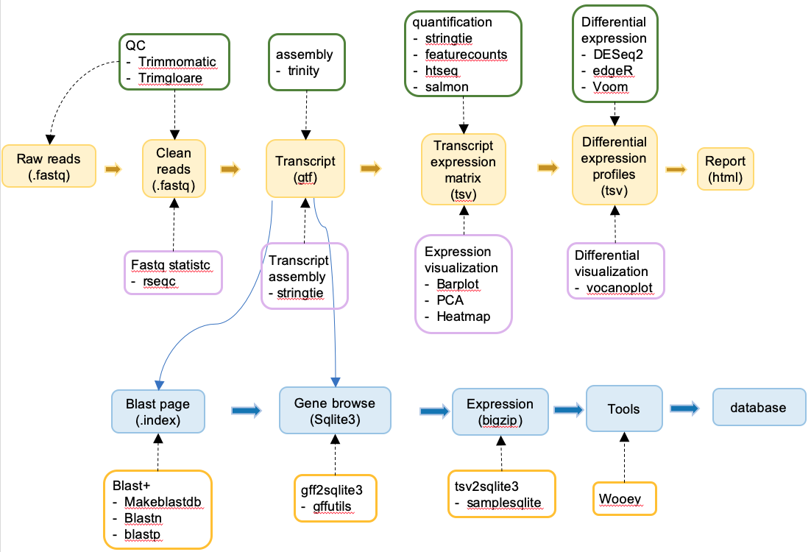

# Reference-free RNA-seq analysis use NGSPipe

#### 

!!! Info inline end
    If this is your first time using NGSPipe, then we strongly recommend that you start by running test data. If you already have experience with NGSPipe, we suggest you can go straight to the custom data section.

Reference genome-free - no genome assembly for the species of interest is available. In this case one would need to assemble the reads into transcripts using de novo approaches. This type of RNAseq is as much of an art as well as science because assembly is heavily parameter-dependent and difficult to do well.
In this lesson we will focus on the Reference genome-based type of RNA seq.

---

!!! note "A typical flow of denovo transcriptome analysis with reference is shown in the figure below"
    <figure markdown> 
        { width="800" }
        <figcaption>Denovo RNA-Seq pipeline</figcaption>
    </figure>

## NGSPipeDb runpipe command line interface

`ngspipedb runpipe -h`

```yaml
Usage: ngspipedb runpipe [OPTIONS] PROJECTNAME

  run a lot of pipeline

  Example:

  python -m ngspipedbcli runpipe ngspipe-rnaseq-basic -n ngspipe-rnaseq-basic
  -d test_pipeline --genomeFasta testdata_ngspipe-rnaseq-basic/genome/chr19.fa
  --genomeAnno testdata_ngspipe-rnaseq-basic/genome/GRCm38.83.chr19.gtf
  --samplefile testdata_ngspipe-rnaseq-basic/rawdata/sample.csv
  --conditionfile testdata_ngspipe-rnaseq-basic/rawdata/condition.csv
  --rawreadsdir testdata_ngspipe-rnaseq-basic/rawdata --snaketype p --report
  -db -ps

Options:
  -n, --pipename [ngspipe-rnaseq-basic|ngspipe-rnaseq-lncRNA|ngspipe-rnaseq-trinity|ngspipe-chipseq|ngspipe-resequencing|ngsdb]
                                  ngspipedb env name  [required]
  -d, --directory PATH            project directory
  -j, --jobs INTEGER              how many cpu to use
  --genomeFasta TEXT              genome sequence file (fasta)
  --genomeAnno TEXT               genome annotation file (gff/gtf)
  --samplefile TEXT               samplefile
  --conditionfile TEXT            conditionfile
  --rawreadsdir TEXT              raw reads directory
  -e, --email_addr TEXT           result directory name (under project
                                  directory)
  --reads_prefix TEXT             reads prefix (Example: _R{}.fq.gz )
  --resultdirname TEXT            result directory name under proect name
                                  directory
  --snaketype [np|p]              `p`: print snakemake shell commands. `np`:
                                  Enable the dry run.
  -r, --report                    generate html report
  -db, --database                 generate database
  -c, --configfile PATH           config file path
  --otherparams TEXT              other snakemake params
  -ps, --printshell               print ngspipedb shell commands
  -h, --help                      Show this message and exit.
```

## Reference-free RNA-Seq analysis on test data <a name="QuickStarted"></a>

### 1. Download test files <a name="Testdata"></a>

NGSPipe is dependent on reference files and raw sequence reads which can be found in [http://www.liu-lab.com/ngspipedb/testdata](http://www.liu-lab.com/ngspipedb/testdata).

To download the mouse RNA-seq test data into current directory:

```shell
ngspipedb download -n ngspipe-rnaseq-basic -t testdata && tar -zxvf testdata-ngspipe-rnaseq-basic.tar.gz
```

- `-n ngspipe-rnaseq-basic` select pipeline name here.
- `-t testdata` select data type is testdata

Make sure you have the following directory structure by command `tree testdata-ngspipe-rnaseq-basic`:

    testdata_ngspipe-rnaseq-basic
    ├── genome
    │   ├── GRCm38.83.chr19.gtf
    │   └── chr19.fa
    └── rawdata
        ├── condition.csv
        ├── control-0_R1.fq.gz
        ├── control-0_R2.fq.gz
        ├── control-1_R1.fq.gz
        ├── control-1_R2.fq.gz
        ├── control-2_R1.fq.gz
        ├── control-2_R2.fq.gz
        ├── sample.csv
        ├── treated-0_R1.fq.gz
        ├── treated-0_R2.fq.gz
        ├── treated-1_R1.fq.gz
        ├── treated-1_R2.fq.gz
        ├── treated-2_R1.fq.gz
        └── treated-2_R2.fq.gz

    2 directories, 16 files

!!! warning
    The test data is only used to verify that the analytical process is working properly and the analysis results do not have a biological significance.

??? note "See help message for subcommand download `ngspipedb download -h`"
    ```yaml
    Usage: ngspipedb download [OPTIONS]

    Commands related to get testdata and database

    Example:

    python -m ngspipedbcli downloaddata -l

    python -m ngspipedbcli downloaddata -n ngspipe-rnaseq-basic -t testdata -o
    run_test/myproject_rnaseq_basic -ps

    Options:
    -l, --list                      list all available files.
    -a, --all                       download all datatypes
    -ps, --printshell               print ngspipedb shell commands
    -o, --directory PATH
    -n, --pipeline [ngspipe-rnaseq-basic|ngspipe-rnaseq-lncRNA|ngspipe-rnaseq-trinity|ngspipe-chipseq|ngspipe-resequencing|ngsdb]
                                    ngspipedb env name
    -p, --platform [osx|linux]      A file name or file path
    -t, --datatype [env|testdata|database]
                                    file types
    -h, --help                      Show this message and exit.
    ```

### 2. Run RNA-seq analysis on test data <a name="RunTest"></a>

We provied a basic reference-free RNA-seq workflow for users to take a glance of ngspipe-rnaseq-trinity. This workflow contains 7 steps:

    1. sampling data (choose part of your data)
    2. raw reads qc
    3. junction align to genome
    4. transcript assembly by trinity
    5. gene quantification
    6. statistic
    7. differential gene analysis

You can do RNA-seq analysis by just one simply command:

```shell
python -m ngspipedbcli runpipe mouse_rnaseq_trinity_analysis -d ../test_pipeline -n ngspipe-rnaseq-trinity --resultdirname result_Sep-18-2021 --samplefile ../testdata_ngspipe-rnaseq-basic/rawdata/sample.csv --conditionfile ../testdata_ngspipe-rnaseq-basic/rawdata/condition.csv --rawreadsdir ../testdata_ngspipe-rnaseq-basic/rawdata --snaketype p
```

- `mouse_rnaseq_trinity_analysis` your project name
- `-n ngspipe-rnaseq-trinity` pipeline name
- `--samplefile testdata_ngspipe-rnaseq-basic/rawdata/sample.csv` give a sample file path, which has one column
- `--conditionfile ../testdata_ngspipe-rnaseq-basic/rawdata/condition.csv` this file is for differential expression
- `--rawreadsdir ../testdata_ngspipe-rnaseq-basic/rawdata` raw reads directory

The final data files are put in the folder `test_pipeline/ngspipe-rnaseq-basic`. Please check you result file `tree -d -L 2 test_pipeline/ngspipe-rnaseq-basic`, it may like this:

    todo

    x directories

!!! Note
    If you encounter any problem in this step, please turn to `TroubleShooting` for help.

## RNA-Seq basic analysis on custom data <a name="custom"></a>

### 1. start a project

Create a directory structure and copy configfile:

```shell
ngspipedb startproject custom_rnaseq_analysis -n ngspipe-rnaseq-trinity
```

Make sure you have the following directory structure by command `tree custom_rnaseq_analysis`:

    custom_rnaseq_analysis
    ├── database
    ├── genome
    ├── ngsdb_config.yaml
    ├── ngspipe_config.yaml
    └── rawdata
        ├── condition.csv
        └── sample.csv

    3 directories, 4 files

??? note "see help message for subcommand startproject: `ngspipedb startproject -h`"
    ```yaml
    Usage: ngspipedb startproject [OPTIONS] PROJECTNAME

    Creates a ngspipedb project directory structure for the given project name
    in the current directory or optionally in the given directory.

    Example:

    python -m ngspipedbcli startproject myproject_rnaseq_basic -n ngspipe-
    rnaseq-basic -ps

    Options:
    -n, --pipeline [ngspipe-rnaseq-basic|ngspipe-rnaseq-lncRNA|ngspipe-rnaseq-trinity|ngspipe-chipseq|ngspipe-resequencing|ngsdb]
                                    pipelines from ngspipedb
    -d, --directory TEXT            project directory
    -ps, --printshell               print ngspipedb shell commands
    -h, --help                      Show this message and exit.
    ```

### 2. modify configfile

rnaseq pipeline need 'reference' and 'raw reads data' in `custom_rnaseq_analysis/ngspipe_config.yaml` to be right setting.

```yaml
#---------------------------
# denovo trinity ranseq
#---------------------------

## 1.raw reads data ##
sample_path: "../rawdata/sample.csv" # sample file
rawreads_dir: "../rawdata" # sample file directory
read1Suffix: "_R1.fq.gz" # fastq suffix, read1
read2Suffix: "_R2.fq.gz"

## 2.condition for differential expression by deseq2 ##
condition_path: "../rawdata/condition.csv"

## 3.output directory ##
results_name: "results_trinity"

## 5.notice ##
# if the string is 'nobody', ngspipe will not send email
# modify 'noboby' to 'xxx@qq.com' or 'xxx@qq.com,yyy@qq.com' to send email
email_addr: 'nobody'

# database
database_eggnog: "../database/eggnog"
```

!!! Warning
    You cannot mix Paired-end and Single-end samples within the same NGSPipe run as this will cause an ERROR. NGSPipe only support Paired-end samples.

!!! Note
    The input, output file paths are relative to the working directory (currently, working directory is `custom_rnaseq_analysis`). If you have used `-d` parameter, for example, `-d run_pipeline_rnaseq_trinity` is given, working directory will be `run_pipeline_rnaseq_trinity/custom_rnaseq_analysis`. Or you can just use absolute path (start from root `/`).

### 3. modify samplefile

And give appropriate content to `custom_rnaseq_analysis/rawdata/sample.csv` and `custom_rnaseq_analysis/rawdata/condition.csv`

one line in `sample.csv` without anything else. Use testdata as an example, 6 samples exists, than it will looks like this:
```yaml
control-0
control-1
control-2
treated-0
treated-1
treated-2
```

### 4. modify conditionfile

Three columns in `condition.csv` with dot split. Users can't change the header `sample_id,Sample,Tissue`. Please put column 3 empty.

```yaml
sample_id,Sample,Tissue
control-0,control,
control-1,control,
control-2,control,
treated-0,treated,
treated-1,treated,
treated-2,treated,
```

### 5. run

```
ngspipedb 
```